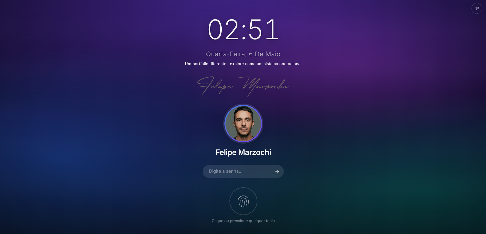
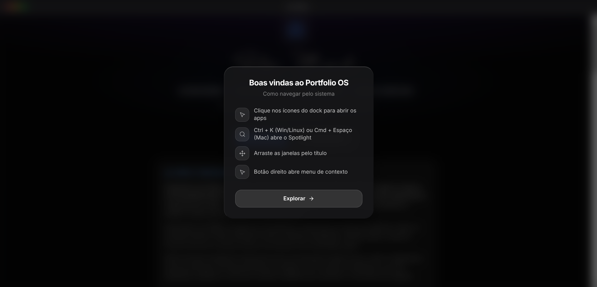
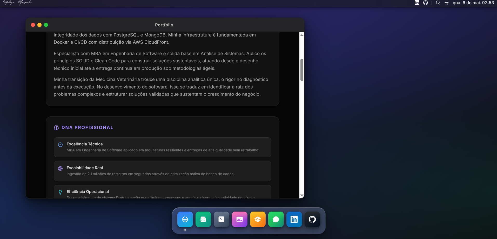
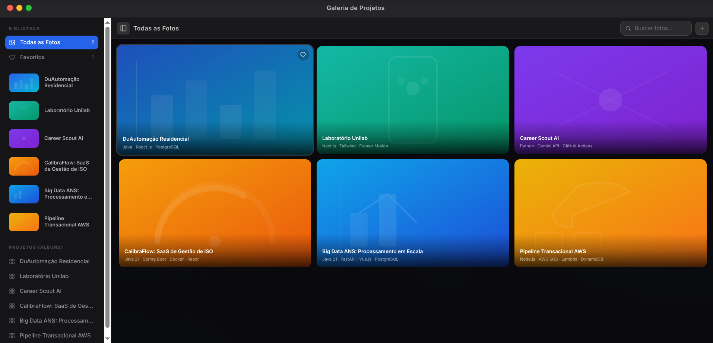
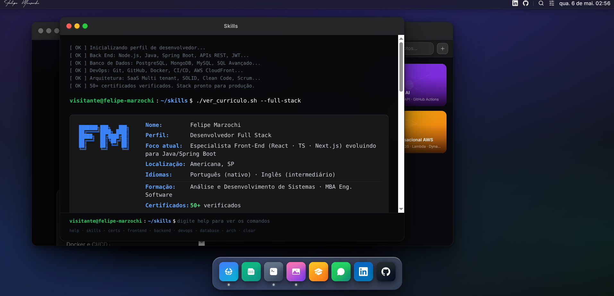
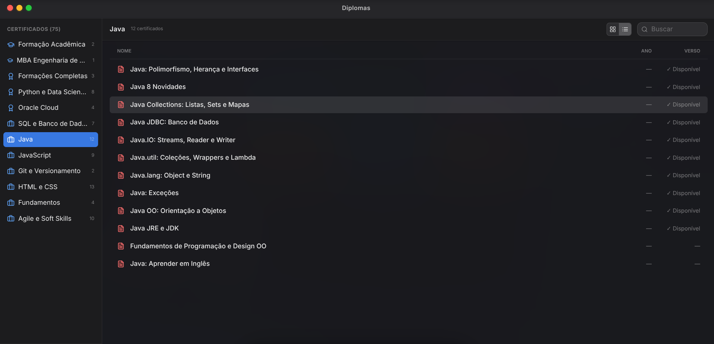
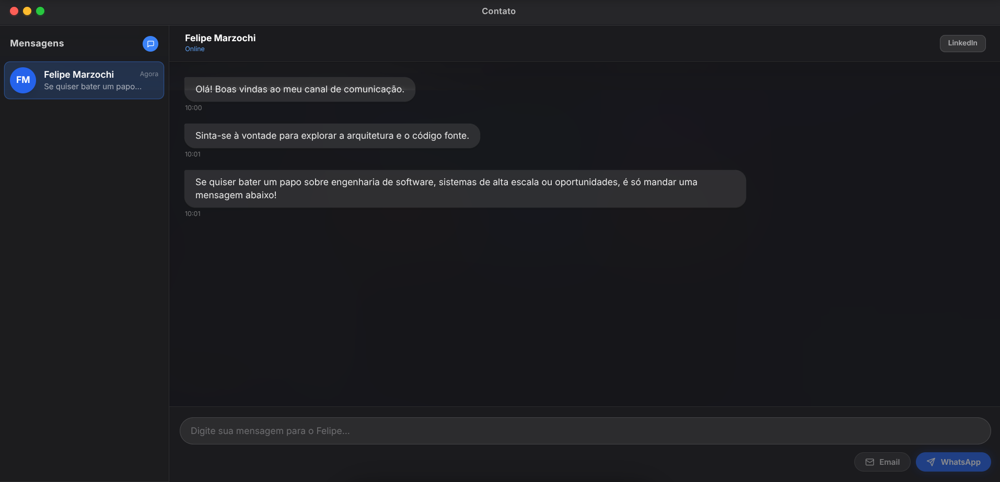
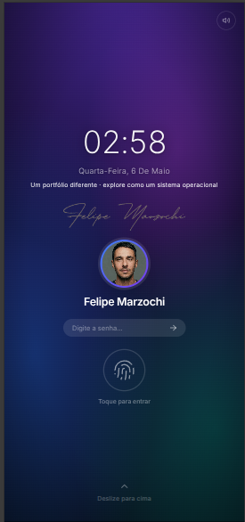
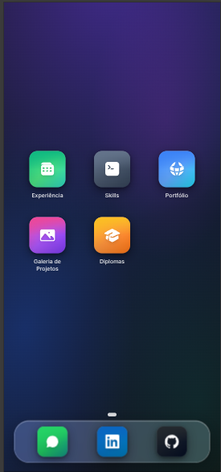

<div align="center">

# Portfolio Felipe Marzochi

### Web OS — Um sistema operacional interativo no browser

[](https://nextjs.org/)
[](https://react.dev/)
[](https://www.typescriptlang.org/)
[](https://tailwindcss.com/)
[](https://www.w3.org/WAI/standards-guidelines/wcag/)
[](https://vlibras.gov.br/)
[](https://www.framer.com/motion/)
[](https://zustand-demo.pmnd.rs/)
[](https://lucide.dev/)
[](https://vercel.com/)

</div>

---

## Sobre o Projeto

Construí este portfólio com uma proposta diferente: em vez de uma página estática com seções empilhadas, desenvolvi um **sistema operacional completo rodando no browser**. A experiência simula um OS real — com tela de bloqueio, janelas arrastáveis, dock com magnificação, apps funcionais e dois layouts adaptativos: **macOS no desktop** e **iOS no mobile**.

Todo o estado do sistema vive no `localStorage` via Zustand — sem nenhum banco de dados, sem servidor de estado externo. O browser é o hardware.

---

## Screenshots

### Desktop Experience

<p align="center">
  
  
</p>
<p align="center">
  
  
</p>
<p align="center">
  
  
</p>
<p align="center">
  
</p>

### Mobile Experience (iOS Style)

<p align="center">
  
  
</p>

---

## Arquitetura

```
src/
├── app/                    # Next.js App Router (layout, page, globals.css)
├── assets/images/          # Recursos estáticos importados pelo código
├── components/
│   ├── apps/               # Cada aplicativo do sistema isolado em seu componente
│   │   ├── AppRegistry.tsx     # Roteador central de apps
│   │   ├── BrowserApp.tsx      # Portfólio de projetos
│   │   ├── ContactsApp.tsx     # Informações de contato
│   │   ├── FinderApp.tsx       # Certificados e conquistas
│   │   ├── GalleryApp.tsx      # Galeria de projetos detalhada
│   │   ├── MapsApp.tsx         # Localização e experiência profissional
│   │   ├── MessagesApp.tsx     # Contato via WhatsApp e e-mail
│   │   ├── PhotosApp.tsx       # Galeria de Projetos
│   │   ├── SkillsApp.tsx       # Terminal interativo de habilidades
│   │   └── TerminalApp.tsx     # Terminal do sistema
│   ├── common/             # Utilitários e componentes compartilhados
│   │   ├── AppErrorBoundary.tsx # Error boundary global da aplicação
│   │   ├── FocusTrap.tsx        # Armadilha de foco para modais e dialogs
│   │   ├── IconRegistry.tsx     # Registro central de ícones SVG do sistema
│   │   └── VLibrasWidget.tsx    # Plugin VLibras (MCTIC/UFPB) para Libras
│   └── os/                 # Infraestrutura do sistema operacional
│       ├── AppWindow.tsx       # Janela arrastável e redimensionável
│       ├── ContextMenu.tsx     # Menu de contexto (clique direito / long-press)
│       ├── ControlCenter.tsx   # Central de controle (volume, brilho, wallpaper)
│       ├── Desktop.tsx         # Área de trabalho com crossfade de wallpaper
│       ├── IOSMobile.tsx       # Layout completo iOS
│       ├── LockScreen.tsx      # Tela de bloqueio
│       ├── MacDock.tsx         # Dock com magnificação (macOS)
│       ├── SpotlightSearch.tsx # Busca global (Win + Espaço / ⌘ + Espaço)
│       ├── TopBar.tsx          # Barra de menu superior (macOS)
│       └── WebOS.tsx           # Orquestrador principal do sistema
├── constants/
│   ├── projects.ts         # Dados dos projetos (metadados, stack, imagens)
│   └── translations.ts     # Dicionário i18n completo (PT · EN · ES)
├── contexts/
│   ├── LanguageContext.tsx # Detecção automática de idioma e provider i18n
│   └── OSContext.tsx       # Estado global do OS (volume, brilho, wallpaper)
├── hooks/
│   ├── useContextMenu.ts   # Lógica de long-press e clique direito
│   └── useIsMobile.ts      # Detecção de dispositivo
├── store/
│   └── useWindowManager.ts # Gerenciador de janelas via Zustand (posição, z-index, tamanho)
└── utils/
    └── audioEngine.ts      # Motor de áudio do sistema
```

---

## Aplicativos

| App | Equivalente | Conteúdo |
|-----|-------------|----------|
| **Browser** | Safari | Portfólio de projetos com links para o GitHub |
| **Finder** | Finder | Certificados organizados por categoria |
| **Skills** | Terminal | Terminal interativo com minhas habilidades técnicas |
| **Maps** | Maps | Localização e trajetória profissional |
| **Messages** | iMessage | Contato direto via WhatsApp ou e-mail |
| **Photos** | Photos | Galeria de Projetos com métricas de impacto |
| **Contacts** | Contacts | Informações profissionais completas |
| **Terminal** | Terminal | Terminal do sistema operacional |

---

## Funcionalidades do Sistema

- **Acessibilidade completa (A11y)** — Infraestrutura semântica com roles e labels para suporte total a leitores de tela (VoiceOver/TalkBack)
- **VLibras (MCTIC/UFPB)** — Plugin oficial do governo brasileiro para tradução do conteúdo em Língua Brasileira de Sinais (Libras), disponível em toda a aplicação via widget flutuante
- **Badge de inclusão na tela de bloqueio** — Indicador visual "100% Acessível · Libras" exibido ao usuário desde o primeiro contato com o sistema
- **Navegação nativa por teclado** — Gerenciamento de foco e atalhos globais para operação inclusiva do sistema
- **Fotos reais nos cards de projetos** — Cada card do portfólio (Browser e Gallery) exibe a foto real do projeto com gradiente como fallback e overlay para preservar legibilidade
- **Otimização de Performance (Next/Image)** — Carregamento inteligente e conversão automática de ativos para WebP, com atributo `sizes` calibrado por breakpoint para cada grade responsiva
- **Normalização de zIndex** — Gerenciamento determinístico de camadas para janelas, prevenindo conflitos de profundidade no estado persistido
- **UX Mobile Blindada** — Prevenção de gestos nativos de sistema (pull-to-refresh) e remoção de artefatos visuais do navegador (tap-highlight)
- **Ergonomia de Desktop** — Janelas com travas de segurança (clamping) e áreas de redimensionamento otimizadas para precisão
- **Arquitetura Centralizada de Ícones** — Registro único de recursos SVG para consistência visual e manutenção simplificada
- **Áreas de toque otimizadas (Hit Targets)** — Botões e controles com área mínima de 44px, garantindo precisão em dispositivos móveis
- **Tela de bloqueio** com desbloqueio por teclado (desktop) ou toque (mobile)
- **Janelas arrastáveis e redimensionáveis** com física de molas via Framer Motion
- **Dock com magnificação** ao passar o mouse (macOS)
- **Central de controle** com ajuste de volume, brilho e troca de wallpaper
- **Spotlight Search** (Win + Espaço / ⌘ + Espaço) com busca entre os apps
- **Menu de contexto** por clique direito (desktop) e long-press (mobile)
- **Ícones móveis no estilo iOS** — drag livre com snap de retorno à posição original
- **Crossfade de wallpaper** animado ao trocar o plano de fundo
- **Múltiplas janelas** abertas simultaneamente com gerenciamento de z-index
- **Persistência de estado** — posição e tamanho das janelas salvas no `localStorage`
- **Layout adaptativo** — iOS no mobile, macOS no desktop (sem media queries manuais)
- **Glassmorphism nativo Apple** — todas as superfícies do sistema e dos apps com vidro fosco fiel ao iOS/macOS

---

## Tecnologias

| Tecnologia | Versão | Uso |
|---|---|---|
| [Next.js](https://nextjs.org/) | 14.2 | Framework principal, App Router, otimização de imagens |
| [React](https://react.dev/) | 18 | UI e gerenciamento de estado local |
| [TypeScript](https://www.typescriptlang.org/) | 5 | Tipagem estática em todo o projeto |
| [Tailwind CSS](https://tailwindcss.com/) | 3 | Estilização utilitária |
| [Framer Motion](https://www.framer.com/motion/) | 11 | Animações, física de molas, drag & drop |
| [Zustand](https://zustand-demo.pmnd.rs/) | 4 | Estado global do OS e gerenciador de janelas |
| [Lucide React](https://lucide.dev/) | 0.360 | Ícones do sistema |
| [Acessibilidade](https://www.w3.org/WAI/standards-guidelines/wcag/) | WCAG 2.1 | Padrões semânticos ARIA e navegação inclusiva |
| [VLibras](https://vlibras.gov.br/) | MCTIC/UFPB | Tradução automática do conteúdo para Libras via widget oficial do governo brasileiro |

---

## Como Rodar Localmente

### Pré-requisitos

- [Node.js](https://nodejs.org/) 18.17 ou superior
- [npm](https://www.npmjs.com/) 9 ou superior

### Instalação

```bash
# 1. Clone o repositório
git clone https://github.com/Fmarzochi/PortfolioFelipeMarzochi.git

# 2. Entre na pasta do projeto
cd PortfolioFelipeMarzochi

# 3. Instale as dependências
npm install

# 4. Inicie o servidor de desenvolvimento
npm run dev
```

Acesse [http://localhost:3000](http://localhost:3000) no browser.

### Outros comandos

```bash
# Build de produção
npm run build

# Iniciar servidor de produção (após o build)
npm start

# Lint do projeto
npm run lint
```

---

## Deploy

O projeto é deployado automaticamente na [Vercel](https://vercel.com/) a cada push na branch `main`. O `package-lock.json` é mantido no repositório para garantir builds determinísticos.

---

## Contato

**Felipe Marzochi**

[](https://www.linkedin.com/in/felipemarzochi)
[](https://github.com/Fmarzochi)
[](mailto:fmarzochi@gmail.com)
